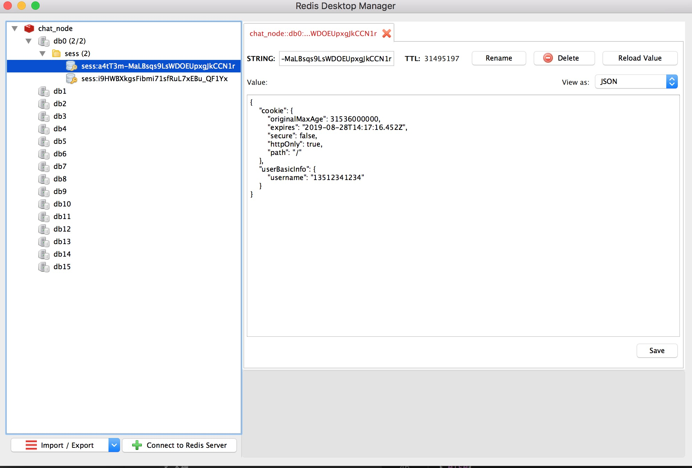
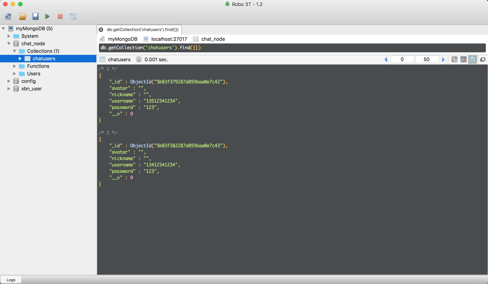

# chatNode

## 准备工作

  1. 先在本地安装好mongodb客户端，可以装个Robo 3T的数据库视图工具
  2. 还需要安装redis服务器，我们数据session缓存存放在redis服务器上,视图工具叫rdm，这些都自行查找文档安装即可
  
## redis和mongodb视图工具图样

  ### redis的rdm可视工具图
  

  ### mongodb的Robo 3T可视工具图
  

## usage

> *首先需要下载项目：git clone git@github.com:Jiangjinjin1/chat_node.git*

> `cd chat_node`

> `npm i` 下载依赖项

> 在安装好mongodb客户端，且通过bash或者oh-my-zsh配置好全局mongod的环境，在任   意位置执行 `mongod`，否则请移步到mongod的相应目录下执行 `mongod`

> 本地起服务执行 `npm run dev`

> 服务启动后在浏览器输入 `localhost:9000` 即可

   
